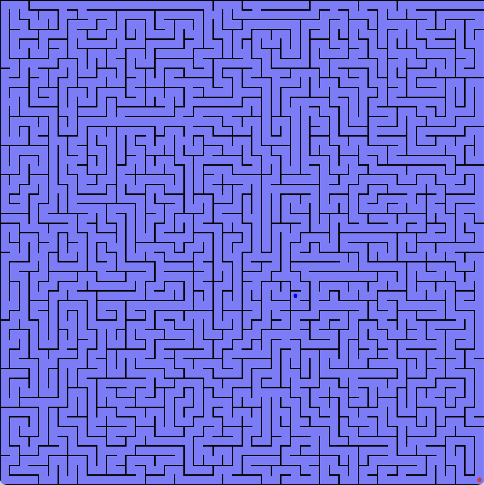

# Encodage de carte de labyrinthes



Lors des challenges, vous pouvez avoir besoin de recevoir la carte globale d'un labyrinthe pour ensuite trouver un
chemin entre deux points (vous et votre équipier peut-être...)

Contrairement à la vue [Radar](RadarView.md), ici on ne représente que les murs, toutes les cellules étant libres par
nature (vous découvrirez leur contenu en parcourant le labyrinthe).

Ainsi un labyrinthe est encodé de la façon suivante:

* Pour chaque emplacement possible pour un mur, en partant d'en haut à gauche, puis ligne par ligne, de haut en bas, le
  bit 1 représente un mur et 0 un passage. On regroupe tous ces bits en octets (en accumulant sur les bits de poids
  forts d'abord), ce qui donne un vecteur d'octets. On crée ainsi un vecteur d'octets pour les murs horizontaux et un
  autre pour les murs verticaux. Pour un labyrinthe de taille (nx, ny), il y a ainsi (ny+1)*nx murs horizontaux et 
  (nx+1)*ny murs verticaux.

  Exemple:
  Pour 18 murs 'actifs' (bits à 1), l'encodage binaire correspond à ceci (regroupé par paquet de 8 pour former les
  octets).
  ```
  0b11111111_11111111_11000000
  ```
  Notez bien le _padding_ de 0 à droite sur les bits de poids faibles.

* On concatène la taille (nx,ny) (i.e. largeur puis hauteur) et ces deux vecteurs d'octets
  (murs horizontaux puis murs verticaux) dans un grand vecteur d'octets.

  ```
  | nx sur 16 bits | ny sur 16 bits | murs horizontaux | murs verticaux |
  ```
  
  Les nombres `nx` et `ny` sont des entiers non-signés encodés en [little endian](https://en.wikipedia.org/wiki/Endianness).

* Encodage avec [b64](./binary_text.md) du tableau total

Les informations de départ/arrivée pour les challenges seront données par ailleurs.